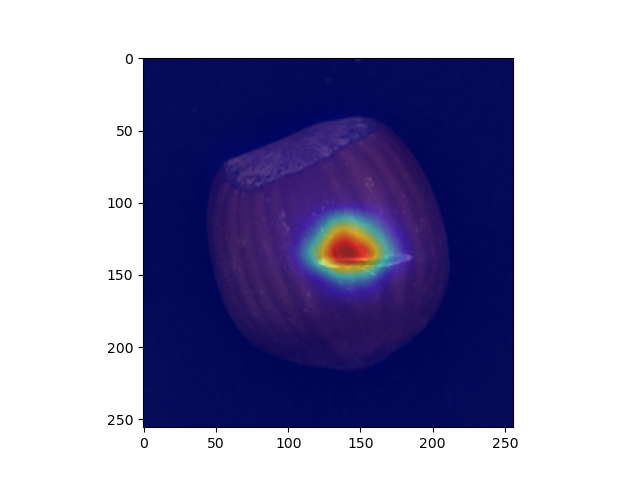
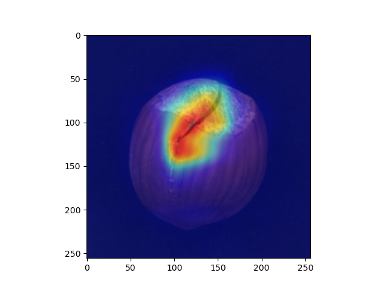
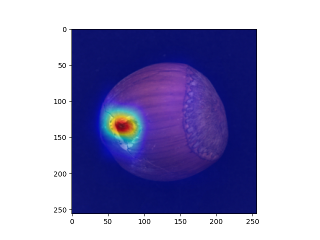

# 🔩 RD-ConvNeXt

**Reverse Distillation · Anomaly Detection · ConvNeXt · PyTorch**

**Anomaly Detection via Reverse Distillation from One-Class Embedding** 모델의  
backbone을 기존 **ResNet**에서 **ConvNeXt**로 교체하여 구현한 이상 탐지 프로젝트입니다.

PyTorch 기반으로 구현했으며, anomaly map 시각화 결과를 포함합니다.

 

---

## Visualization

  
  
  

---

## 주요 내용

- Reverse Distillation 기반 anomaly detection
- 기존 ResNet backbone을 ConvNeXt backbone으로 교체
- PyTorch 기반 구현
- Anomaly map 시각화

---

## Reference

**Anomaly Detection via Reverse Distillation from One-Class Embedding**
